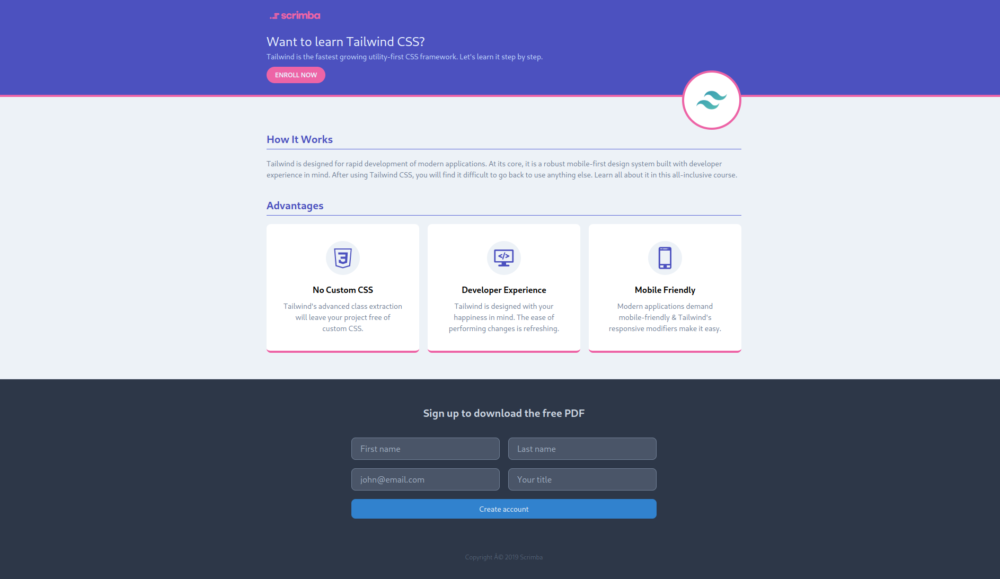

# TailwindCSS - Landing Page

Tailwind CSS is a utility-first framework for rapidly building custom designs. This tutorial will teach your Tailwind from scratch, using a mix of lectures and interactive coding challenges.



Quick start:

```
$ npm install
$ npm start
```

Head over to https://vitejs.dev/ to learn more about using vite
Happy Coding!
